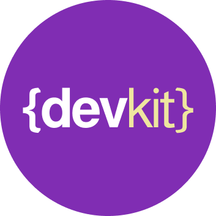

# Manifestomuz

**Geliştirdiğimiz yazılımları topluluğa sunarken motivasyonumuz şu şekildedir.**

- Yazılımcı değil developer ya da geliştirici 
- Programlama bir sanattır
- Üretilen her yazılım kar etmekten daha büyük bir amaç içindir
- Geliştirdiğin yazılım ticari bir sır, bir patent ya da sözleşmeler ile korunmuş değilse bunu topluluğun kullanımına ver
- Topluluğa (Açık kaynak topluluğu) sunulan her yazılım ondan fayda elde etmek isteyen için zararsız olmalıdır.
- Sunulan yazılımın dokümantasyonu (inline doc, wiki, flowchart, uml,..) proje içinde “doc” klasöründe açıkça paylaşılır.
- Versiyon güncellemesinin kapsamı açıkça belirtilir.
- Sunulan paketin kullanım örnekleri “example” klasörü içinde yer alır.
- Sunulan yazılım paketi ile ilgili geri bildirimler (issues) bir sonraki commit’ ler ile değerlendirilir ve kapatılır.
- Sunulan yazılımın gelişmesini sağlayan her pull-request kabul edilir.
- Paketlerin stable (kararlı) sürümleri öncesinde refactoring (detaylı elden geçirme) yapılır.
- Sunulan yazılımın lisans modeli LICANCE dosyası ile mutlaka belirtilir.
- Sunulan yazılım paketini geliştiren ilk programcı, topluluk desteği aldıktan sonra yazılım üzerinde hak iddia etmez. Topluluğa mal olan topluluğundur.
- Sunulan paket ya da yazılımı kullanan geliştiriciler için en büyük sorumluluk topluluğa teşekkür etmektir.

# Kaynaklar ve Linkler

- [`Medium`] 
- [`Meetup`] 
- [`Twitter`] 

[`Medium`]: https://medium.com/developer-kitchen
[`Meetup`]: https://www.meetup.com/tr-TR/developer-kitchen/
[`Twitter`]: https://twitter.com/DevKitchenTr